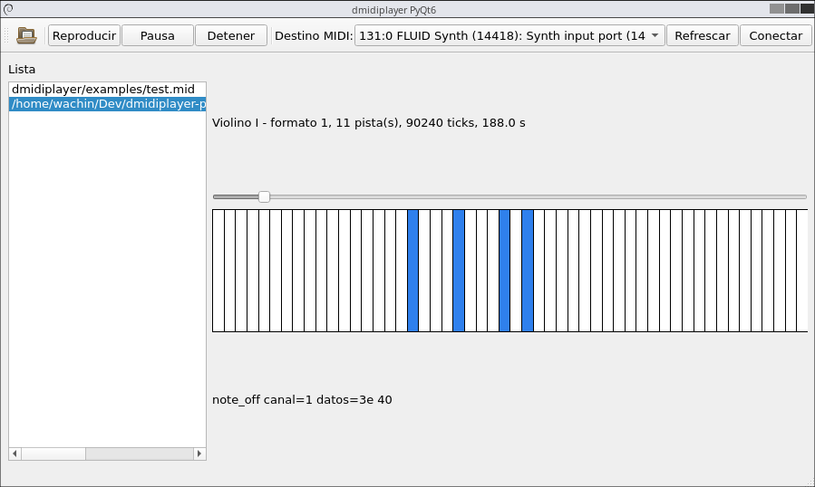

# dmidiplayer PyQt6 port

Este repositorio contiene una conversion progresiva de Drumstick/dmidiplayer a
Qt/Python con PyQt6. El codigo C++ original se conserva como referencia y la
version Python vive en paquetes paralelos dentro del mismo arbol:

- `drumstick-2.11.0/drumstick_py`
- `dmidiplayer/dmidiplayer_py`

## Entorno de pruebas actual

Las pruebas manuales se estan haciendo en MX Linux 23.

En ese sistema se instalo el kernel RT disponible en los mismos repositorios de
MX Linux 23 y se configuro junto con los paquetes indicados para esta migracion,
incluyendo PyQt6, ALSA y utilidades MIDI.

Para escuchar la salida MIDI real se instalo tambien:

- QjackCtl
- QSynth
- `fluid-soundfont-gm`

La fuente de sonido usada para las pruebas es `FluidR3.sf2`, instalada por el
paquete `fluid-soundfont-gm`. Esta fuente se cargo en QSynth desde la
configuracion `Soundfonts`.

Con QjackCtl activo y QSynth abierto, dmidiplayer PyQt6 puede enviar eventos por
ALSA sequencer hacia QSynth. La aplicacion tambien incluye un selector de
destinos MIDI ALSA para conectar la salida directamente desde la interfaz.

## Como probar

Para probar, usar uno de los `.mid` de `dmidiplayer/examples`, por ejemplo:

```bash
./dmidiplayer/dmidiplayer-py dmidiplayer/examples/test.mid
```

y aparecerá la ventana y sonando el programa:



Tambien puedes probar con otros:

```bash
./dmidiplayer/dmidiplayer-py dmidiplayer/examples/Schubert_Standchen.mid
./dmidiplayer/dmidiplayer-py dmidiplayer/examples/haendel_hallelujah.mid
./dmidiplayer/dmidiplayer-py dmidiplayer/examples/mozart_aveverum.mid
```

Ejecuta esos comandos desde la raiz del proyecto:

```bash
cd /home/wachin/Dev/dmidiplayer-port-qt_py
./dmidiplayer/dmidiplayer-py dmidiplayer/examples/test.mid
```

Si QSynth ya esta abierto, la app intentara conectarse automaticamente a un
destino que parezca QSynth/FluidSynth. Si no lo hace, usa el selector `Destino
MIDI`, pulsa `Refrescar` y luego `Conectar`.

## Verificacion rapida

```bash
./dmidiplayer/dmidiplayer-py --help
PYTHONPATH=drumstick-2.11.0:dmidiplayer python3 -m compileall drumstick-2.11.0/drumstick_py dmidiplayer/dmidiplayer_py tests
PYTHONPATH=drumstick-2.11.0:dmidiplayer python3 -m unittest tests.test_smf_parser tests.test_alsa_event
```
